# Cloud-Native DevOps Platform on AWS EKS with CI/CD, Security Scanning, Auto Scaling and Monitoring

## Overview

This project demonstrates the implementation of a complete cloud-native DevOps platform on AWS using Infrastructure as Code, Continuous Integration and Continuous Deployment, Kubernetes orchestration, security scanning, monitoring, observability, and frontend hosting.

The infrastructure is provisioned using Terraform and deployed in the AWS Hyderabad Region (**ap-south-2**).

The platform consists of two containerized microservices deployed on Amazon EKS, automated CI/CD pipelines using Jenkins, vulnerability scanning using Trivy, container registry management using Amazon ECR, monitoring using Prometheus and Grafana, and a static frontend hosted on Amazon S3.

---

# Architecture Diagram

```text
                              ┌──────────────────┐
                              │      GitHub      │
                              │ Source Code Repo │
                              └────────┬─────────┘
                                       │
                                       ▼
                          ┌─────────────────────────┐
                          │        Jenkins          │
                          │      CI/CD Server       │
                          └────────┬────────────────┘
                                   │
                  ┌────────────────┼────────────────┐
                  │                │                │
                  ▼                ▼                ▼
         ┌─────────────┐   ┌─────────────┐  ┌─────────────┐
         │ Unit Tests  │   │ Docker Build│  │ Trivy Scan  │
         └─────────────┘   └─────────────┘  └─────────────┘
                                   │
                                   ▼
                        ┌────────────────────┐
                        │    Amazon ECR      │
                        │ Container Registry │
                        └─────────┬──────────┘
                                  │
                                  ▼
                      ┌────────────────────────┐
                      │       Amazon EKS       │
                      │ Kubernetes Cluster     │
                      └─────────┬──────────────┘
                                │
                 ┌──────────────┴──────────────┐
                 │                             │
                 ▼                             ▼
      ┌──────────────────┐          ┌──────────────────┐
      │   User Service   │          │ Product Service  │
      └──────────────────┘          └──────────────────┘
                 │                             │
                 └──────────────┬──────────────┘
                                │
                                ▼
                      ┌──────────────────┐
                      │ Kubernetes HPA   │
                      │ Auto Scaling     │
                      └──────────────────┘

                                │
                                ▼
                ┌────────────────────────────────┐
                │ Prometheus + Grafana Monitoring│
                └────────────────────────────────┘

                                ▲
                                │
                                ▼

                     ┌─────────────────────┐
                     │  Amazon S3 Website  │
                     │     Frontend UI     │
                     └─────────────────────┘
```

---

# Technology Stack

## Cloud

- AWS

## Infrastructure as Code

- Terraform

## CI/CD

- Jenkins

## Containerization

- Docker

## Security

- Trivy

## Container Registry

- Amazon ECR

## Orchestration

- Amazon EKS
- Kubernetes

## Monitoring

- Prometheus
- Grafana
- AlertManager

## Frontend Hosting

- Amazon S3 Static Website Hosting

## Version Control

- Git
- GitHub

---

# Project Objectives

This project was built to demonstrate:

- Infrastructure as Code using Terraform
- Automated CI/CD pipeline implementation
- Kubernetes-based application deployment
- Container security scanning
- Horizontal auto-scaling
- Monitoring and observability
- Cloud-native deployment practices
- Production-style DevOps workflows

---

# Infrastructure Provisioning

All AWS infrastructure was provisioned using Terraform.

## Resources Created

- VPC
- Public Subnets
- Private Subnets
- Internet Gateway
- Route Tables
- Security Groups
- IAM Roles
- IAM Policies
- EKS Cluster
- EKS Managed Node Groups

---

# Terraform Backend Configuration

Terraform remote state management was implemented using:

## Amazon S3

Stores Terraform state files remotely.

## Amazon DynamoDB

Provides Terraform state locking to prevent concurrent infrastructure modifications.

---

# Application Architecture

The platform contains two independent microservices.

## User Service

The User Service is responsible for user-related operations.

### Components

- Flask Application
- Dockerfile
- Kubernetes Deployment
- Kubernetes Service
- Horizontal Pod Autoscaler

---

## Product Service

The Product Service is responsible for product-related operations.

### Components

- Flask Application
- Dockerfile
- Kubernetes Deployment
- Kubernetes Service
- Horizontal Pod Autoscaler

---

# CI/CD Pipeline Workflow

The Jenkins pipeline automates the entire deployment lifecycle.

## Stage 1 – Source Code Checkout

Fetches the latest application source code from GitHub.

## Stage 2 – Dependency Installation

Installs required Python dependencies.

## Stage 3 – Security Scanning

Performs vulnerability scanning using Trivy.

## Stage 4 – Docker Build

Builds application container images.

## Stage 5 – Push to Amazon ECR

Pushes Docker images to Amazon Elastic Container Registry.

## Stage 6 – Deploy to EKS

Deploys updated application versions to Kubernetes.

## Stage 7 – Rollout Verification

Verifies successful deployment rollout.

## Stage 8 – Notifications

Sends deployment status notifications.

---

# Kubernetes Deployment Strategy

Applications are deployed using:

- Kubernetes Deployments
- Kubernetes Services
- Kubernetes Namespaces
- Horizontal Pod Autoscalers

Deployment strategy includes:

- Rolling Updates
- Zero Downtime Deployment
- Health Verification
- Automated Scaling

---

# Monitoring and Observability

Monitoring was implemented using the Prometheus Operator Stack.

## Components

### Prometheus

Collects metrics from:

- Kubernetes Cluster
- Nodes
- Pods
- Services

### Grafana

Provides dashboards and visualization.

### AlertManager

Manages alert routing and notifications.

### kube-state-metrics

Provides Kubernetes object metrics.

### Node Exporter

Collects node-level metrics.

---

# Frontend Deployment

The frontend application is hosted using:

- Amazon S3 Static Website Hosting

The frontend communicates with backend APIs running inside the EKS cluster.

---

# Screenshots

## Amazon EKS Cluster

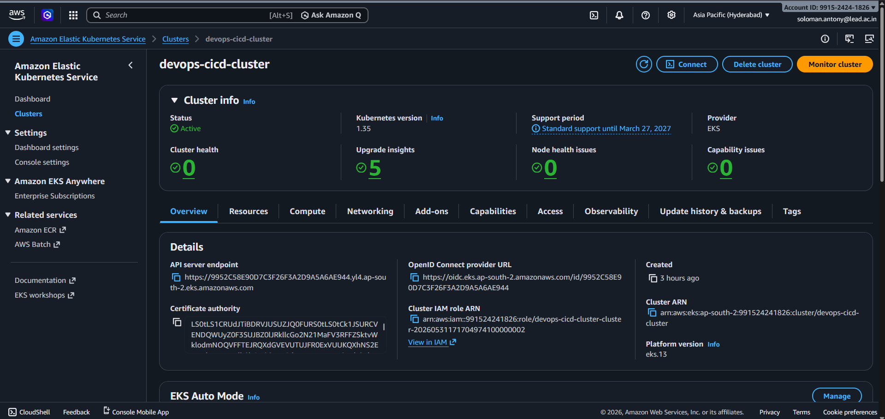

---

## EKS Worker Nodes

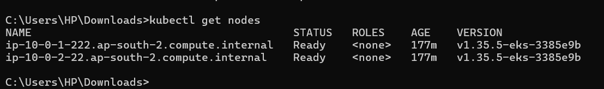

---

## Jenkins Dashboard

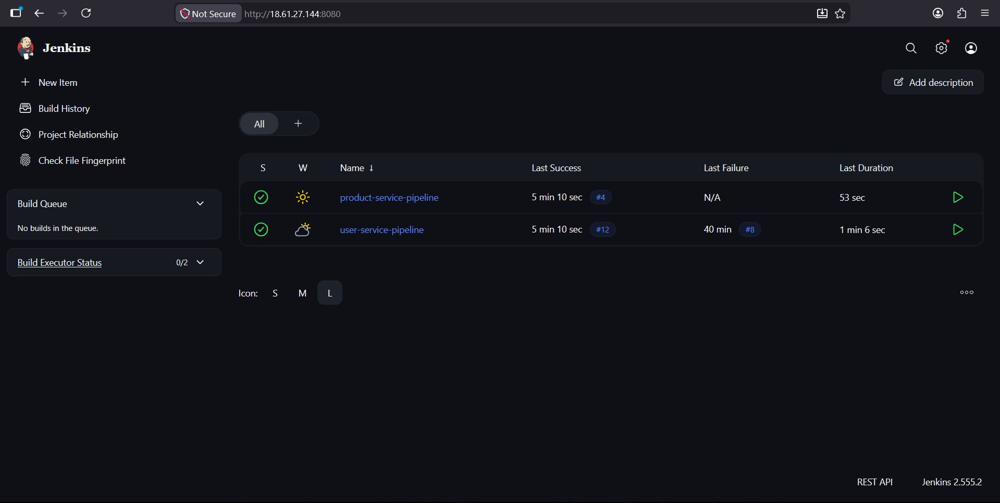

---

## Successful User Service Pipeline

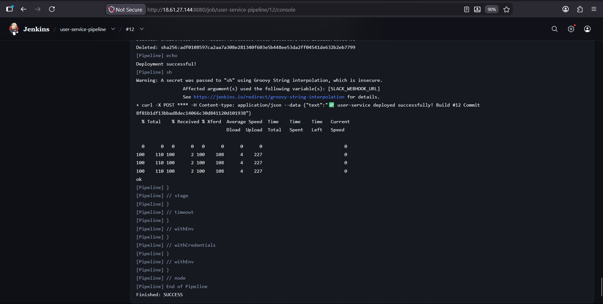

---

## Successful Product Service Pipeline

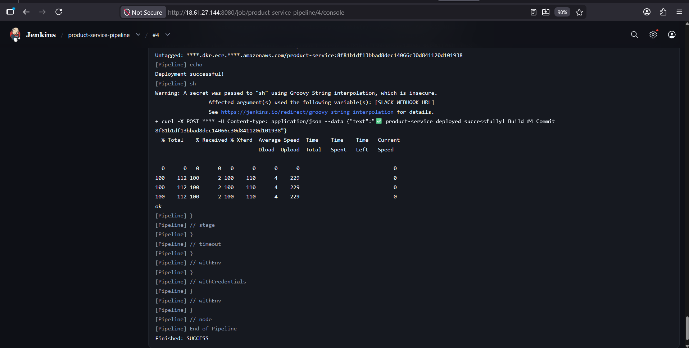

---

## Amazon ECR Repositories

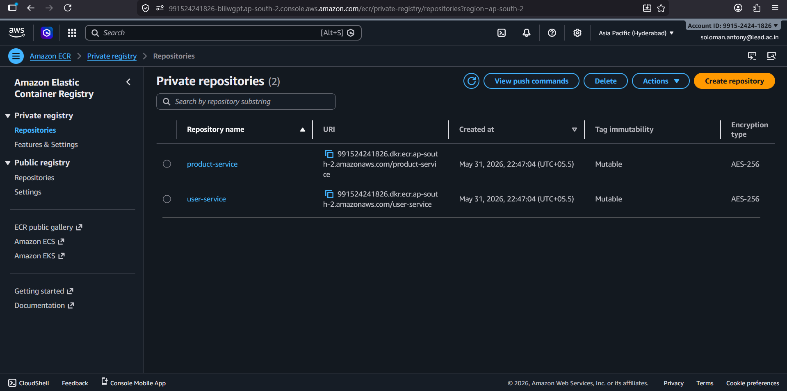

---

## Running Kubernetes Workloads

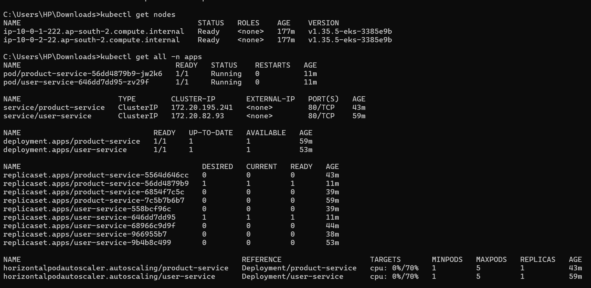

---

## Horizontal Pod Autoscaler

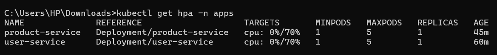

---

## Load Balancer

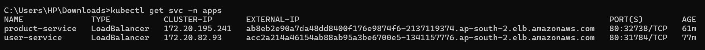

---

## Monitoring Pods

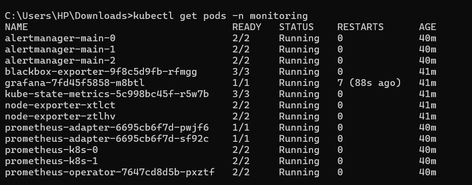

---

## Prometheus Targets

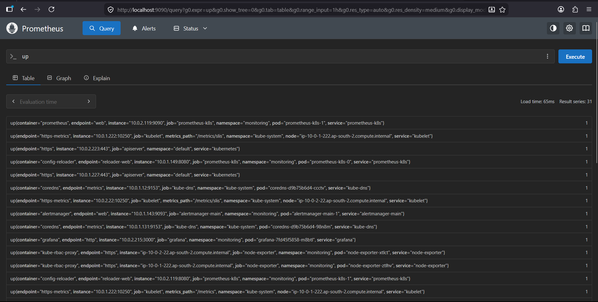

---

## Grafana Cluster Dashboard

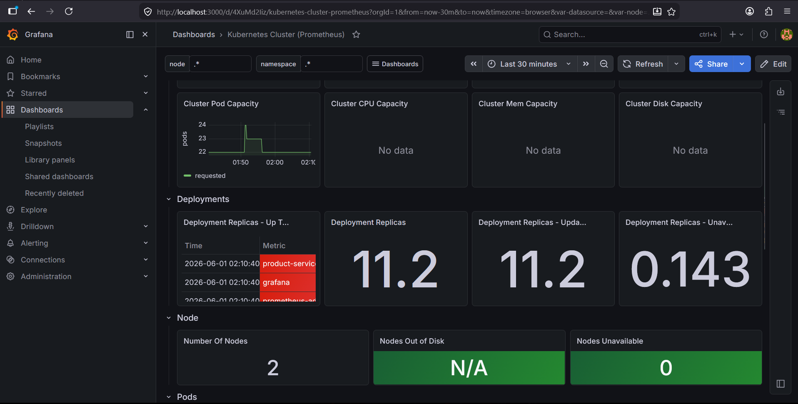

---

## Grafana Pod Dashboard

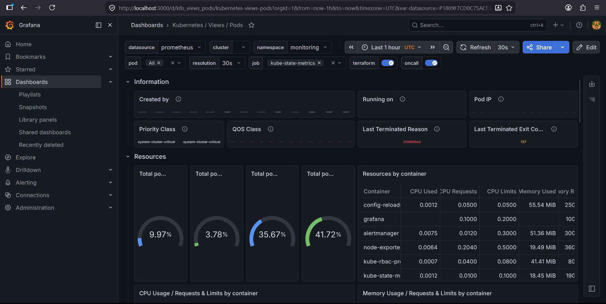

---

## Cluster Monitoring Dashboard

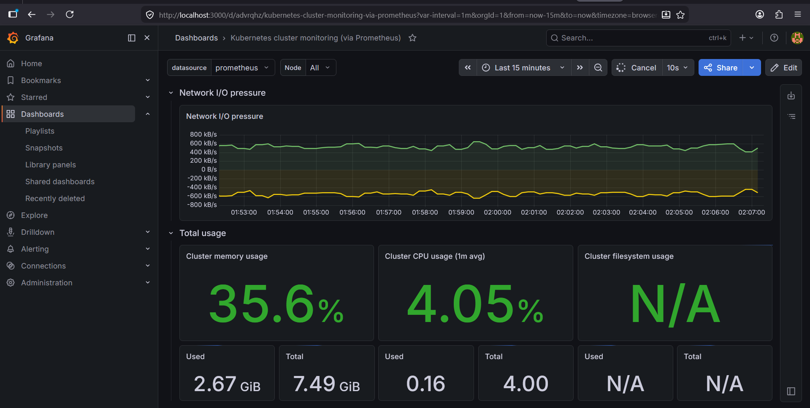

---

## Frontend Hosted on Amazon S3

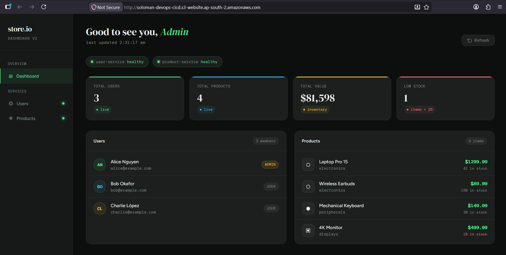

---

## Application Health Check

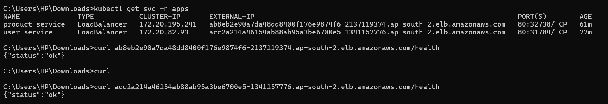

---

## Terraform Remote State (S3)

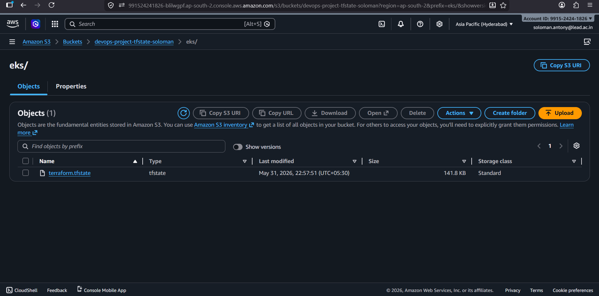

---

## Terraform State Locking (DynamoDB)

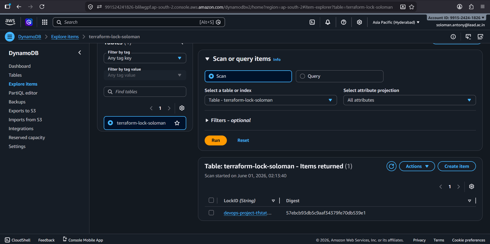

---

## Terraform Resources (Part 1)

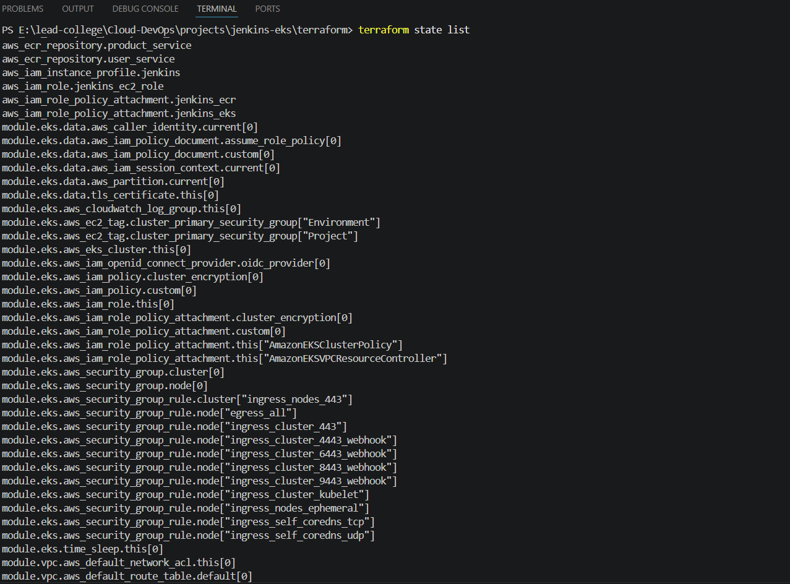

---

## Terraform Resources (Part 2)

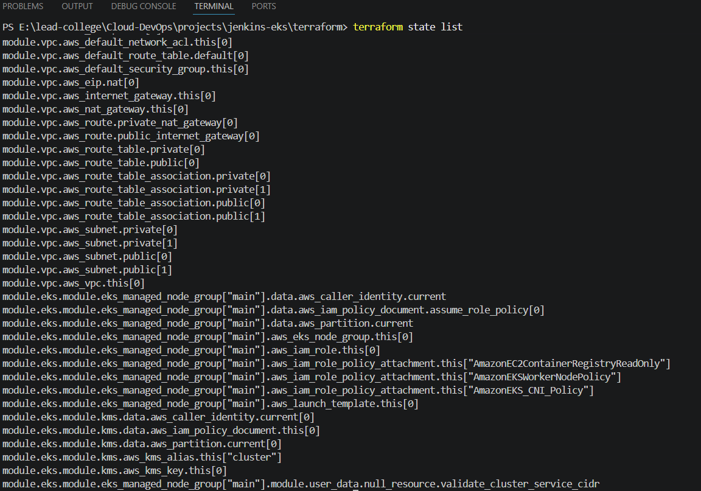

---

## Slack Notifications

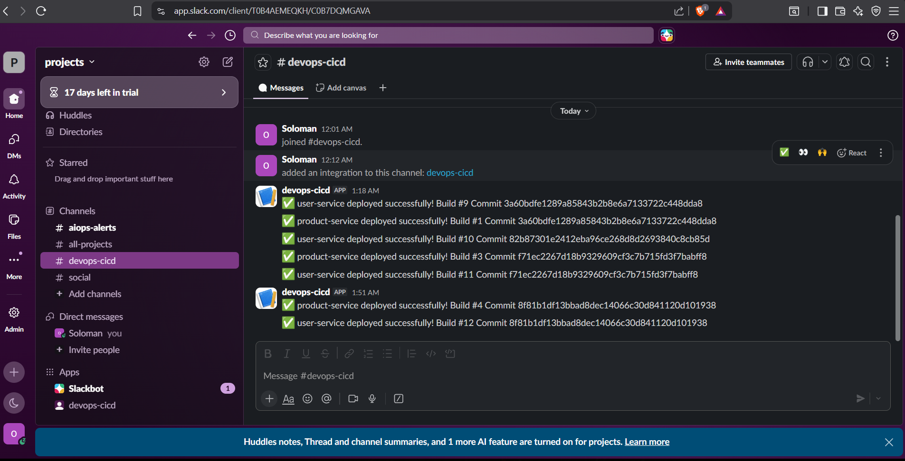

---

# AWS Services Used

- Amazon EC2
- Amazon EKS
- Amazon ECR
- Amazon VPC
- Amazon IAM
- Amazon DynamoDB
- Amazon S3
- Amazon CloudWatch
- Elastic Load Balancer

---

# Key Achievements

- Infrastructure provisioning using Terraform
- Remote Terraform state management
- CI/CD automation using Jenkins
- Docker image build and deployment
- Vulnerability scanning using Trivy
- Container image storage using Amazon ECR
- Kubernetes deployment on Amazon EKS
- Horizontal Pod Autoscaling
- Monitoring using Prometheus and Grafana
- Frontend hosting using Amazon S3
- End-to-end cloud-native DevOps implementation

---

# Outcome

Successfully implemented a production-style DevOps platform capable of:

- Automated infrastructure provisioning
- Automated application deployment
- Container image security scanning
- Kubernetes orchestration
- Application auto-scaling
- Monitoring and observability
- Frontend hosting
- Remote state management
- Cloud-native application delivery

This project demonstrates a complete end-to-end DevOps workflow using AWS services and modern cloud-native technologies.

## 👨‍💻 Author

**Soloman Antony**